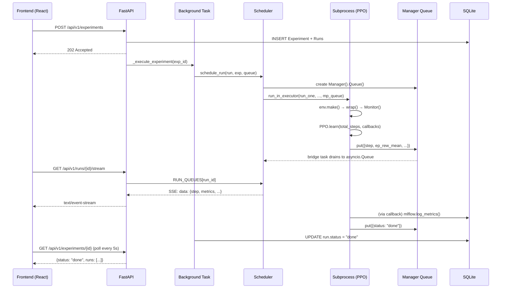

# RL-Reward-Lab 系统架构

## v0.1 架构概览

```
┌──────────────────────────────────────────────────────────────────┐
│                        User / Browser                            │
│              React 18 + TS 5 + Vite + ECharts 5                  │
└──────────────────────────────┬───────────────────────────────────┘
                               │ REST + SSE (HTTP/1.1)
                               ▼
┌──────────────────────────────────────────────────────────────────┐
│                     API Layer (FastAPI 0.135+)                    │
│  ┌──────────┐ ┌──────────┐ ┌──────────┐ ┌──────────┐ ┌───────┐ │
│  │  /envs   │ │ /rewards │ │/experiments│ │  /runs   │ │/stream│ │
│  └──────────┘ └──────────┘ └──────────┘ └──────────┘ └───────┘ │
│                          │                                       │
│                   Pydantic v2 Schemas                             │
│            (ExperimentCreate, RunSummary, MetricEvent)            │
└──────────────────────────────┬───────────────────────────────────┘
                               │
              ┌────────────────┼────────────────┐
              ▼                ▼                ▼
┌──────────────────┐ ┌──────────────┐ ┌──────────────────┐
│   Control Plane  │ │Execution Plane│ │   Data Plane     │
│  (experiments.py)│ │  (scheduler,  │ │ (SQLAlchemy +    │
│  Background Tasks │ │   run_one,   │ │  MLflow SQLite)  │
│                  │ │   callbacks)  │ │                  │
└──────────────────┘ └──────┬───────┘ └──────────────────┘
                            │
                   ProcessPoolExecutor
                   (Manager Queue IPC)
                            │
              ┌─────────────┼─────────────┐
              ▼             ▼             ▼
        ┌──────────┐ ┌──────────┐ ┌──────────┐
        │  SB3 PPO │ │ Reward   │ │ Env      │
        │ (MlpPol) │ │ Wrapper  │ │ Gymnasium│
        └──────────┘ └──────────┘ └──────────┘
```

## 四层架构

| 层 | 目录 | 职责 | v0.1 实现 |
|---|---|---|---|
| **用户与 API 层** | `frontend/`, `backend/app/api/` | 请求验证、路由、SSE 推送 | FastAPI routes + Pydantic schemas |
| **实验控制层** | `backend/app/api/routes/experiments.py` | 实验创建、状态管理、Run 调度 | BackgroundTasks + async session |
| **训练执行层** | `backend/app/workers/` | 子进程训练、IPC、MLflow 追踪 | ProcessPoolExecutor + Manager Queue |
| **数据与分析层** | `backend/app/db/`, MLflow | 元数据存储、指标记录、工件管理 | SQLAlchemy + MLflow SQLite |

## 核心数据流



## 四种元对象

| 对象 | 位置 | 作用 |
|---|---|---|
| `EnvSpec` | `schemas/domain.py`, `core/registry.py` | 抽象环境能力（离散/连续、可渲染、可向量化） |
| `RewardSpec` | `rewards/base.py`, `rewards/variants.py` | 把奖励从硬编码提升为独立配置对象，含分量定义和论文引用 |
| `AlgoSpec` | `core/registry.py` | 抽象训练器差异（策略类型、支持空间、默认超参） |
| `RunSpec` | 由 Experiment + Run ORM 隐式实现 | 保证可复现性（commit、seed、reward 哈希） |

## 奖励系统架构

```
rewards/
├── base.py          # RewardSpec ABC + to_dict()
├── wrappers.py      # PBRSWrapper, SparseWrapper, DenseProgressWrapper,
│                    #   MisleadingRewardWrapper
├── variants.py      # REWARD_REGISTRY: 5 个具体变体
│   ├── SparseReward      (R0)  # 仅终局信号
│   ├── DenseReward       (R1)  # 手工进度信号
│   ├── PBRSReward        (R2)  # 势函数塑形 (Ng & Russell 1999)
│   ├── CuriosityRNDReward(R3)  # 内在动机 (SparseWrapper + RNDCallback)
│   └── MisleadingReward  (R4)  # ⚠ 教学反例
└── rnd.py           # RNDCallback (替代 rlexplore)
```

**Wrapper 顺序约定 (ADR-003)**: `Monitor(RewardWrapper(env))` — Monitor 必须最外层，确保 `ep_rew_mean` 记录的是原始任务奖励。

## 关键设计决策

| 决策 | ADR | 理由 |
|---|---|---|
| v0.1 仅 PPO | ADR-002 | 离散+连续双支持，稳定性最高，SB3 官方推荐 |
| MountainCar 为主环境 | ADR-002 | 稀疏奖励"教科书演示场"，PPO 50k 步不加 shaping 学不会 |
| SSE 而非 WebSocket | ADR-001 | 训练曲线单向流，代码量 1/3，内建自动重连 |
| SQLite 而非 PostgreSQL | ADR-001 | 零配置，5-10 人并发写入极低，日均 <50 实验 |
| ProcessPoolExecutor | ADR-001 | 单机场景，Ray Tune 有 10× 调度开销 |
| Manager Queue | (Phase 3) | Windows spawn 模式下唯一可序列化的跨进程队列 |

## 部署拓扑（v0.1 单机）

```
localhost:5173 (Vite dev server)
       │
       ├── /api/* → proxy → localhost:8000 (Uvicorn)
       │                        │
       │                        ├── SQLite (data/rl_lab.db)
       │                        ├── MLflow SQLite (data/mlflow.db)
       │                        └── ProcessPoolExecutor (训练子进程)
       │
       └── Static files (React SPA)
```
