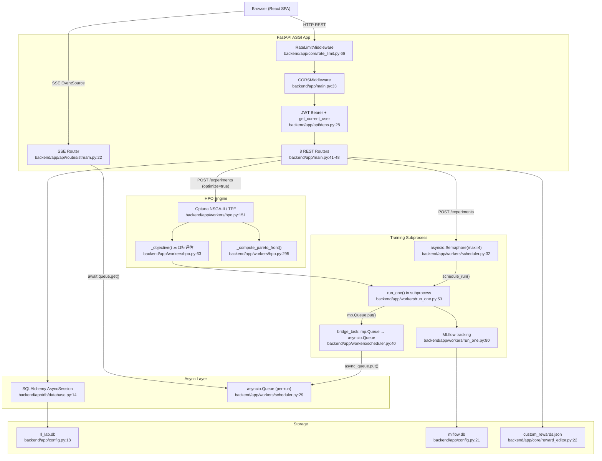
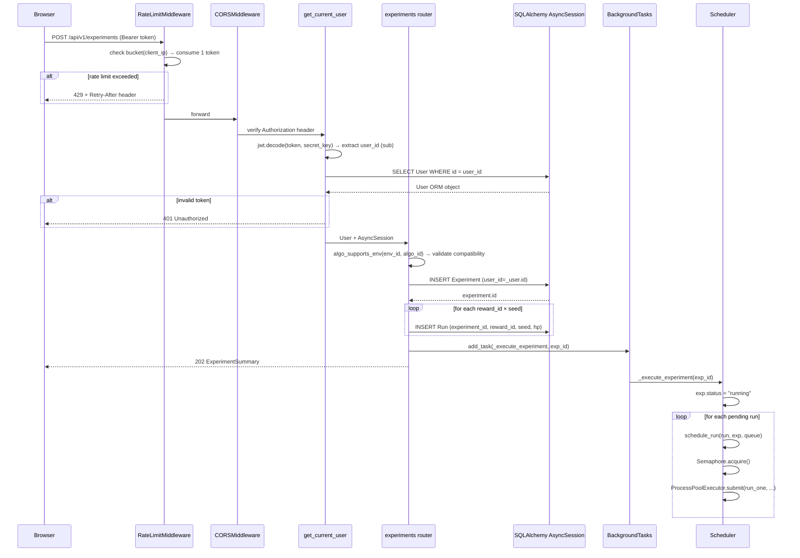
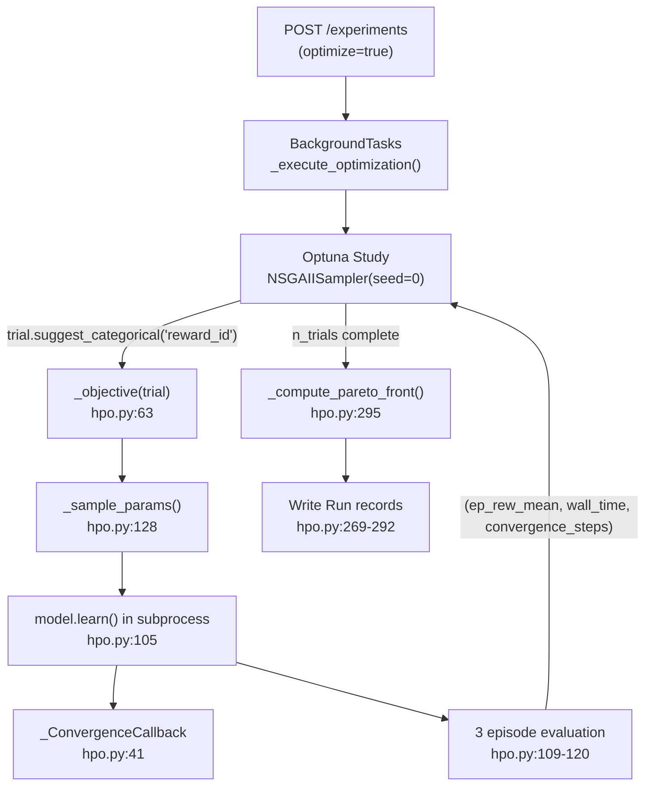
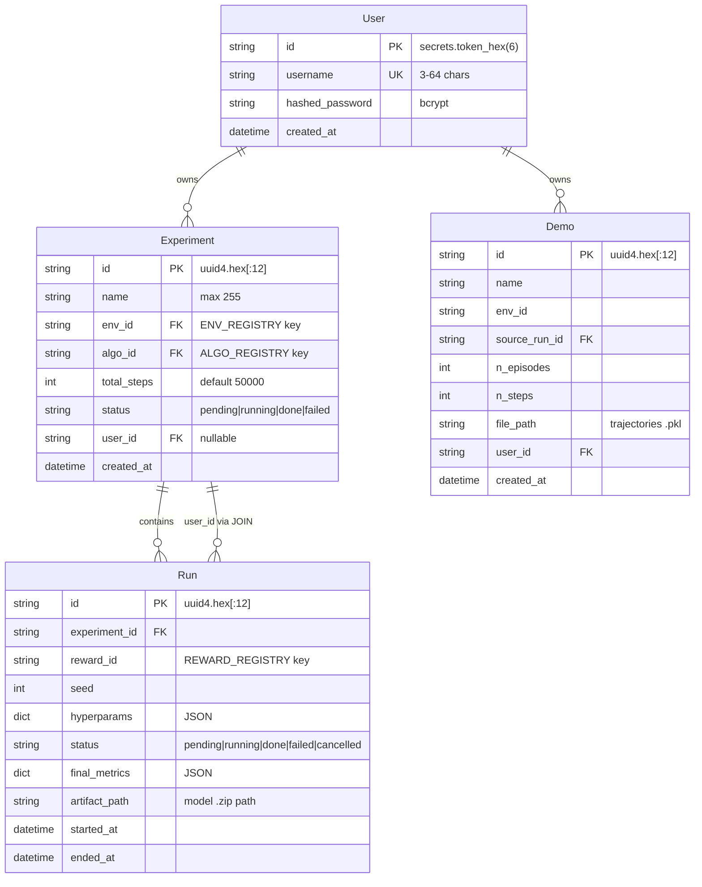

# RL-Reward-Lab 系统架构

> 版本：v1.3.0 | 最后更新：2026-05-02

## 1. 系统分层架构

RL-Reward-Lab 采用经典三层架构，核心挑战在于**跨进程训练通信**（Windows spawn 模式）和**实时数据推送**。

```
┌─────────────────────────────────────────────────────────────────────────┐
│                        前端 SPA (React 19 + Vite 8)                      │
│  src/api/client.ts ── REST fetch ──────────────────────────────────────> │
│  src/api/stream.ts ── SSE EventSource ─────────────────────────────────> │
│  src/stores/authStore.ts ── Zustand (localStorage persist)              │
└─────────────────────────────────────────────────────────────────────────┘
                                    │
                                    │ HTTP / SSE
                                    ▼
┌─────────────────────────────────────────────────────────────────────────┐
│                    ASGI 中间件层 (Starlette/FastAPI)                      │
│  1. RateLimitMiddleware (token-bucket, 30/min write)                    │
│  2. CORSMiddleware (allow_origins, credentials)                         │
│  3. HTTPBearer → get_current_user → JWT decode → DB lookup              │
│  4. APIRouter → 8 路由模块调度                                            │
│  依据: backend/app/main.py:31-48                                         │
└─────────────────────────────────────────────────────────────────────────┘
                                    │
                          ┌─────────┼─────────┐
                          ▼         ▼         ▼
┌──────────────────┐ ┌──────────────┐ ┌──────────────────┐
│  SQLAlchemy      │ │  asyncio     │ │  ProcessPool     │
│  AsyncSession    │ │  Queue       │ │  Executor        │
│  (CRUD + 迁移)    │ │  (SSE 消费)   │ │  (训练子进程)      │
│  依据:            │ │  依据:        │ │  依据:            │
│  db/database.py  │ │  scheduler.py│ │  scheduler.py:23 │
└──────────────────┘ └──────────────┘ └──────────────────┘
                          │                    │
                          │   Manager().Queue() │
                          │ ◄────────────────── │
                          │   _bridge() task    │
                          │   依据: scheduler.py:40-55
                          ▼
┌─────────────────────────────────────────────────────────────────────────┐
│                       数据持久化层 (data/)                                 │
│  rl_lab.db (SQLite/PostgreSQL) — 实验/用户/Run                           │
│  mlflow.db (SQLite) — Optuna study / 训练指标                             │
│  custom_rewards.json — 自定义奖励代码                                      │
│  demos/ — 专家轨迹 .pkl                                                   │
│  videos/ — 策略回放 .mp4                                                  │
│  checkpoints/ — 模型 .zip                                                │
└─────────────────────────────────────────────────────────────────────────┘
```

### Mermaid 架构全景图



---

## 2. 请求生命周期

一条典型的实验创建请求的完整路径：



### 中间件执行顺序

```python
# backend/app/main.py:31-39 — 顺序决定执行链
app.add_middleware(RateLimitMiddleware)  # 第1层：限速先于一切
app.add_middleware(CORSMiddleware, ...)  # 第2层：CORS 头处理
# get_current_user 依赖注入在路由层执行（非中间件）
```

> **关键细节**：`RateLimitMiddleware` 在 CORS 之前注册，确保被限速的请求在生成 CORS 预检响应前就被拦截。

---

## 3. 训练子进程通信（核心架构决策）

这是整个平台最复杂的部分。Windows 的 `multiprocessing` 使用 `spawn` 模式（而非 Linux 的 `fork`），意味着**子进程从零启动一个新的 Python 解释器**。

### 为什么使用 Manager().Queue()

```
┌──────────────────────────────────────────────────────────────────┐
│  问题：mp.Queue() 在 Windows spawn 下不可序列化                    │
│  依据：backend/app/workers/scheduler.py:8-11 (docstring)          │
│                                                                  │
│  解决：mp.Manager().Queue() 代理对象可被 pickle 序列化              │
│  _manager = mp.Manager()  # 进程级单例，存活于整个主进程            │
│  依据：backend/app/workers/scheduler.py:26                        │
└──────────────────────────────────────────────────────────────────┘
```

### 数据流详解

```mermaid
graph LR
    subgraph "Main Process (asyncio event loop)"
        BRIDGE["_bridge() async task<br/>scheduler.py:40"]
        AQ["asyncio.Queue<br/>scheduler.py:29"]
    end

    subgraph "ProcessPoolExecutor"
        MPQ["Manager().Queue()<br/>scheduler.py:65"]
        P1["Subprocess<br/>run_one()"]
        CB["StreamCallback<br/>workers/callbacks.py"]
    end

    subgraph "FastAPI SSE"
        EG["event_generator()<br/>stream.py:28"]
        ES["EventSourceResponse<br/>stream.py:36"]
    end

    P1 -->|"mp_queue.put(metric_msg)"| MPQ
    CB -->|"every=1000 steps"| P1
    MPQ -->|"mp_queue.get(timeout=1.0)"| BRIDGE
    BRIDGE -->|"async_queue.put(msg)"| AQ
    AQ -->|"await queue.get()"| EG
    EG -->|"yield event: metric"| ES
    ES -->|"text/event-stream"| Browser
```



### 步骤分解

| 步骤 | 代码位置 | 说明 |
|------|----------|------|
| 1. 信号量获取 | `scheduler.py:67` | `async with _run_semaphore:` 限制同时训练数 |
| 2. 创建 mp.Queue | `scheduler.py:65` | `_manager.Queue(maxsize=500)` 跨进程代理 |
| 3. 启动 bridge | `scheduler.py:70` | `asyncio.create_task(_bridge(mp_queue, async_queue))` |
| 4. 提交子进程 | `scheduler.py:75-86` | `loop.run_in_executor(executor, run_one, ...)` |
| 5. 子进程训练 | `run_one.py:158` | `model.learn(total_timesteps, callback=StreamCallback)` |
| 6. 回调写队列 | `workers/callbacks.py` (StreamCallback) | `queue.put({"run_id":..., "metrics":..., "step":...})` |
| 7. Bridge 转发 | `scheduler.py:40-55` | `mp_queue.get(timeout=1.0)` → `async_queue.put(msg)` |
| 8. SSE 消费 | `stream.py:31` | `msg = await asyncio.wait_for(queue.get(), timeout=15.0)` |
| 9. 哨兵信号 | `scheduler.py:92` | `mp_queue.put(None)` 标记训练完成 |
| 10. 清理 | `scheduler.py:96-100` | `await bridge_task` 等待 bridge 排空 |

### 回调：StreamCallback

```
训练子进程 (run_one.py:143)
  └── model.learn(callback=StreamCallback(queue, run_id, reward_id, every=1000))
        └── _on_step(): 每 1000 步
              └── queue.put({
                    "run_id": run_id,
                    "reward_id": reward_id,
                    "step": self.num_timesteps,
                    "wall_time": ...,
                    "metrics": {"ep_rew_mean": ..., "loss": ...},
                    "components": {"extrinsic": ..., "shaping_pbrs": ...},
                  })
```

### SSE 端点

```python
# backend/app/api/routes/stream.py:22-36
@router.get("/runs/{run_id}/stream")
async def stream_run(run_id: str):
    queue = RUN_QUEUES.get(run_id)
    if queue is None:
        raise HTTPException(404, "Run not found or not running")

    async def event_generator():
        while True:
            try:
                msg = await asyncio.wait_for(queue.get(), timeout=15.0)
                yield {"event": "metric", "data": json.dumps(msg, default=str)}
            except asyncio.TimeoutError:
                yield {"event": "ping", "data": ""}  # 15s 保活

    return EventSourceResponse(event_generator())
```

---

## 4. HPO 优化引擎

### Optuna + NSGA-II 三目标优化



### 目标函数

```python
# backend/app/workers/hpo.py:63-125
def _objective(trial, env_id, algo_id, reward_ids, total_steps,
               search_space, fixed_hp, baseline_reward) -> tuple[float, float, float]:
    # 1. Optuna 采样 reward_id + 超参
    reward_id = trial.suggest_categorical("reward_id", reward_ids)
    hp = _sample_params(trial, search_space, fixed_hp)
    
    # 2. 训练 agent
    model.learn(total_timesteps=total_steps, callback=conv_cb)
    wall_time = time.perf_counter() - t0
    
    # 3. 评估 3 个 episode，取均值
    o1 = mean_ep_reward    # maximize
    o2 = wall_time          # minimize
    o3 = convergence_step   # minimize (未收敛则返回 total_steps)
    return (o1, o2, o3)
```

### Pareto 前沿计算

```python
# backend/app/workers/hpo.py:295-314
def _compute_pareto_front(trial_results: list[dict]) -> list[int]:
    # O1 (maximize) 取反 → 统一为"越小越好"
    values[:, 0] = -values[:, 0]
    
    # 支配关系判定：i 支配 j 当 i 在所有维度 ≤ j 且至少一个 < j
    dominated = set()
    for i in range(n):
        for j in range(n):
            if np.all(values[i] >= values[j]) and np.any(values[i] > values[j]):
                dominated.add(i)
    
    return [i for i in range(n) if i not in dominated]
```

### 单目标回退

当 `n_objectives=1` 时，自动回退到 TPE Sampler 单目标优化：
- `backend/app/workers/hpo.py:188-197`

---

## 5. 数据模型 (ER 图)



> **关键设计决策**：Run 没有直接 `user_id` 字段。取消 Run 时通过 JOIN Experiment 验证所有权：
> ```python
> # backend/app/api/routes/runs.py:40-44
> select(RunModel).join(Experiment, RunModel.experiment_id == Experiment.id)
>     .where(RunModel.id == run_id, Experiment.user_id == _user.id)
> ```

### 自定义奖励存储

自定义奖励不走 SQL 表，而是 JSON 文件持久化：

```json
// data/custom_rewards.json
{
  "C_a1b2c3d4e5f6": {
    "code": "def reward_fn(obs, reward, terminated, truncated):\n    ...",
    "name": "My Custom Reward",
    "user_id": "a1b2c3d4e5f6"
  }
}
```

- 键 = `C_` + SHA256(code)[:12] → 幂等去重
- `user_id` 字段实现行级隔离
- 子进程通过 `_load_persisted()` 在 import 时加载 → 写入 `REWARD_REGISTRY`
- 依据：`backend/app/core/reward_editor.py:22,68-82,84-91`

---

## 6. 安全边界

```
┌─────────────────────────────────────────────────────────────┐
│  第1层：传输层 — JWT HS256, 24h 过期                          │
│  backend/app/core/auth.py:12-30                              │
├─────────────────────────────────────────────────────────────┤
│  第2层：密码存储 — bcrypt (salt rounds = auto)                 │
│  backend/app/core/auth.py:16-17                              │
├─────────────────────────────────────────────────────────────┤
│  第3层：代码注入防护 — AST 白名单校验                           │
│  backend/app/core/reward_editor.py:26-181                    │
│  允许: math, numpy, 标准控制流/运算                            │
│  禁止: os, sys, subprocess, socket, eval, exec               │
├─────────────────────────────────────────────────────────────┤
│  第4层：进程隔离 — 训练在 ProcessPoolExecutor 子进程执行        │
│  backend/app/workers/scheduler.py:23                         │
├─────────────────────────────────────────────────────────────┤
│  第5层：速率限制 — Token-bucket per-IP, 30/min (writes only)  │
│  backend/app/core/rate_limit.py:25-63                        │
├─────────────────────────────────────────────────────────────┤
│  第6层：数据隔离 — 所有查询 WHERE user_id = current_user.id    │
│  backend/app/api/routes/experiments.py:131,168               │
└─────────────────────────────────────────────────────────────┘
```

---

## 7. 关键设计决策

| 决策 | 选择 | 原因 |
|------|------|------|
| 进程通信 | `Manager().Queue()` | Windows spawn 下 `mp.Queue()` 不可 pickle |
| 限速算法 | Fixed-window counter | 管理工具场景足够，无需 leaky bucket 复杂度 |
| 自定义奖励存储 | JSON 文件 | 避免 SQLite 迁移负担，子进程 import 时自然加载 |
| 多目标优化 | NSGA-II (Optuna) | 开箱即用的 Pareto 搜索，三目标自然映射 |
| SSE 保活 | 15s ping | 防止代理/浏览器断开空闲连接 |
| 前端节流 | 250ms / 4fps | 平衡流畅度与 CPU 占用，低于人眼感知阈值 |
| 降采样策略 | 均匀取每第 2 点 | 保持趋势形状，O(n) 复杂度 |
| 测试认证旁路 | `PYTEST_CURRENT_TEST` env | ASGITransport 不触发 lifespan，需绕过真实认证 |

---

## 8. 部署拓扑

```
┌──────────────────────────────────────────────┐
│  Docker Compose (docker-compose.yml)          │
│                                               │
│  ┌─────────────────┐  ┌─────────────────────┐ │
│  │ frontend (nginx) │  │ backend (uvicorn)   │ │
│  │ port: 80         │  │ port: 8000           │ │
│  │ depends_on:      │  │ restart: unless-     │ │
│  │   - backend      │  │   stopped            │ │
│  └─────────────────┘  └──────────┬──────────┘ │
│                                  │             │
│                   ┌──────────────┴──────────┐  │
│                   │ volumes:                │  │
│                   │   ./data:/app/data      │  │
│                   └─────────────────────────┘  │
│  docker-compose.yml:1-31                       │
└──────────────────────────────────────────────┘
```

前端的 Nginx 配置将 API 请求代理到 backend:8000，静态资源由 Nginx 直接提供服务。
