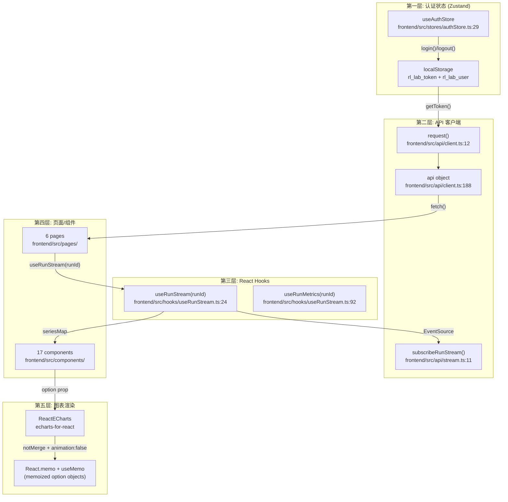
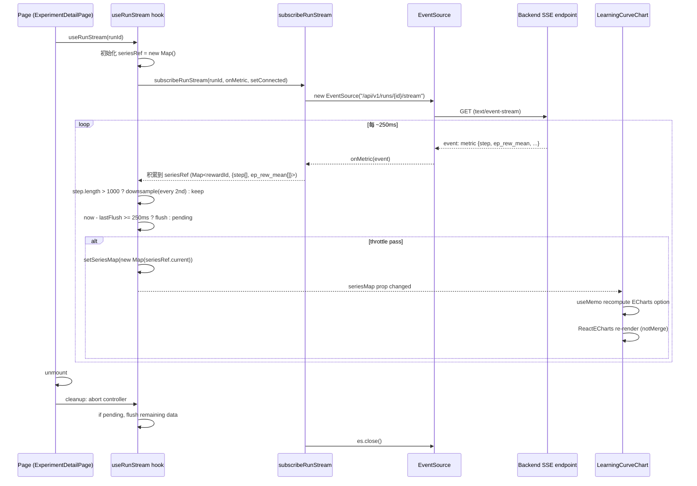

# RL-Reward-Lab 前端开发者指南

> 版本：v1.3.0 | 最后更新：2026-05-02

## 1. 技术栈与项目结构

| 依赖 | 版本 | 用途 |
|------|------|------|
| React | 19 | UI 框架 |
| TypeScript | 5.x | 类型系统 |
| Vite | 8 | 构建工具与开发服务器 |
| TanStack Query | 5 | 服务端状态管理 |
| Zustand | 5 | 客户端状态管理 |
| Apache ECharts | 6 (echarts-for-react) | 可视化图表 |
| Tailwind CSS | 3 | 样式工具 |
| React Router | 6 | 路由 |

### 目录结构

```
frontend/
├── src/
│   ├── App.tsx                         # 路由定义 + ProtectedRoute
│   ├── api/
│   │   ├── client.ts                   # REST API 客户端 (所有端点 + 类型定义)
│   │   └── stream.ts                   # SSE EventSource 封装
│   ├── stores/
│   │   └── authStore.ts                # Zustand: token + user 状态
│   ├── hooks/
│   │   └── useRunStream.ts             # SSE 实时数据 hook + useRunMetrics
│   ├── components/
│   │   ├── Layout/
│   │   │   ├── MainLayout.tsx          # 页面布局壳 (Navbar + Outlet)
│   │   │   └── Navbar.tsx              # 导航栏 + 用户信息 + 登出
│   │   ├── ExperimentForm/
│   │   │   ├── ExperimentForm.tsx      # 实验创建表单 (主编排)
│   │   │   ├── EnvSelector.tsx         # 环境选择器
│   │   │   ├── RewardMultiSelect.tsx   # 奖励多选 (含 Edit 入口)
│   │   │   ├── RewardEditor.tsx        # Monaco 代码编辑器
│   │   │   ├── HyperParamPanel.tsx     # 超参编辑
│   │   │   └── SearchSpaceEditor.tsx   # HPO 搜索空间编辑器
│   │   ├── MonitorPanel/
│   │   │   ├── MonitorPanel.tsx        # Run 实时监控 (SSE 消费者)
│   │   │   ├── LearningCurveChart.tsx  # 学习曲线 (React.memo ECharts)
│   │   │   ├── MultiRunChart.tsx       # 多 Run 叠加对比曲线
│   │   │   ├── HealthCard.tsx          # 训练健康指标卡片
│   │   │   ├── OptimizationCharts.tsx  # HPO 结果 6 图面板
│   │   │   ├── ParetoChart.tsx         # Pareto 2D+3D 散点图
│   │   │   └── ParetoWeightPanel.tsx   # Pareto 权重滑块 + 推荐
│   │   ├── CompareView/
│   │   │   └── CompareView.tsx         # 批量实验对比视图
│   │   └── ReplayViewer/
│   │       └── ReplayViewer.tsx        # 策略回放视频播放器
│   └── pages/
│       ├── LoginPage.tsx               # 登录页
│       ├── RegisterPage.tsx            # 注册页
│       ├── ExperimentListPage.tsx      # 实验列表 (筛选/搜索/分页/批量选择)
│       ├── NewExperimentPage.tsx       # 新建实验 (加载 envs/algos/rewards)
│       ├── ExperimentDetailPage.tsx    # 实验详情 (监控/HPO/回放/Demo收集)
│       └── DemoListPage.tsx            # Demo 管理
├── nginx.conf                          # 生产 Nginx 配置
├── Dockerfile                          # 多阶段构建
├── package.json
├── tsconfig.json
└── vite.config.ts
```

---

## 2. 状态管理与数据流

### 整体数据流图



### Zustand Auth Store

```typescript
// frontend/src/stores/authStore.ts:29-47
export const useAuthStore = create<AuthState>((set, get) => {
  const stored = localStorage.getItem(TOKEN_KEY);
  return {
    token: stored,                              // 从 localStorage 恢复
    user: stored ? loadUser() : null,            // 从 localStorage 恢复
    isAuthenticated: !!stored,
    login: (token, user) => {
      localStorage.setItem(TOKEN_KEY, token);
      localStorage.setItem(USER_KEY, JSON.stringify(user));
      set({ token, user, isAuthenticated: true });
    },
    logout: () => {
      localStorage.removeItem(TOKEN_KEY);
      localStorage.removeItem(USER_KEY);
      set({ token: null, user: null, isAuthenticated: false });
    },
    getToken: () => get().token,
  };
});
```

Store 被以下组件消费：
- `App.tsx:16` — `ProtectedRoute` 检查 `isAuthenticated`
- `Navbar.tsx:7-8` — 显示 `user.username` + 登出按钮
- `client.ts:13` — `getToken()` 附加到 fetch headers

### API 客户端认证拦截

```typescript
// frontend/src/api/client.ts:12-22
async function request<T>(url: string, options?: RequestInit): Promise<T> {
  const token = getToken();
  const headers: Record<string, string> = {
    "Content-Type": "application/json",
  };
  if (token) {
    headers["Authorization"] = `Bearer ${token}`;
  }
  const res = await fetch(url, { ...options, headers });

  // 401 自动登出 + 重定向
  if (res.status === 401) {
    localStorage.removeItem(TOKEN_KEY);
    window.location.href = `/login?from=${encodeURIComponent(window.location.pathname)}`;
    throw new Error("401: Authentication required");
  }
  // ...
}
```

### SSE 实时数据流（深度解析）



#### 降采样逻辑

```typescript
// frontend/src/hooks/useRunStream.ts:13-22
function _downsample(step: number[], values: number[]): { step: number[]; values: number[] } {
  const factor = 2;
  const newStep: number[] = [];
  const newValues: number[] = [];
  for (let i = 0; i < step.length; i += factor) {
    newStep.push(step[i]);
    newValues.push(values[i]);
  }
  return { step: newStep, values: newValues };
}

// 触发条件: s.step.length > MAX_POINTS * 2 (= 1000)
// 策略: 均匀取每第 2 个点，保持趋势形状
// 依据: frontend/src/hooks/useRunStream.ts:60-64
```

#### 节流逻辑

```typescript
// frontend/src/hooks/useRunStream.ts:68-76
const now = performance.now();
if (now - lastFlushRef.current >= THROTTLE_MS) {  // 250ms
  lastFlushRef.current = now;
  pendingRef.current = false;
  setSeriesMap(new Map(seriesRef.current));        // 触发 React 渲染
} else {
  pendingRef.current = true;                       // 标记有待刷新数据
}

// 组件卸载时 flush 残留
// frontend/src/hooks/useRunStream.ts:81-84
return () => {
  ctrl.abort();
  if (pendingRef.current) { _flush(); }
};
```

---

## 3. 组件树与路由

### 路由结构

```
App (QueryClientProvider > BrowserRouter)
├── /login          → LoginPage           (无需认证)
├── /register       → RegisterPage         (无需认证)
└── ProtectedRoute (检查 isAuthenticated)
    └── MainLayout (Navbar + Outlet)
        ├── /                   → ExperimentListPage
        ├── /new                → NewExperimentPage
        │                           └── ExperimentForm
        │                               ├── EnvSelector
        │                               ├── RewardMultiSelect
        │                               ├── RewardEditor (Modal)
        │                               ├── HyperParamPanel
        │                               └── SearchSpaceEditor
        ├── /experiments/:id    → ExperimentDetailPage
        │                           ├── MonitorPanel
        │                           │   ├── LearningCurveChart
        │                           │   └── HealthCard
        │                           ├── MultiRunChart
        │                           ├── OptimizationCharts
        │                           │   ├── ReactECharts (6 种子图表)
        │                           │   ├── ParetoWeightPanel
        │                           │   └── ParetoChart
        │                           └── ReplayViewer
        ├── /demos              → DemoListPage
        └── /compare?ids=...    → CompareView
                                    └── MultiRunChart
```

依据：`frontend/src/App.tsx:23-47`

### ProtectedRoute

```typescript
// frontend/src/App.tsx:15-21
function ProtectedRoute({ children }: { children: React.ReactNode }) {
  const isAuthenticated = useAuthStore((s) => s.isAuthenticated);
  if (!isAuthenticated) {
    return <Navigate to="/login" replace />;
  }
  return <>{children}</>;
}
```

---

## 4. 核心组件职责

| 组件 | 文件 | 职责 | 关键 Props |
|------|------|------|-----------|
| **ExperimentForm** | `ExperimentForm.tsx` | 创建实验的主表单：编排环境/算法/奖励/超参选择，提交或开启 HPO | `envs, algos, rewards, prefill` |
| **EnvSelector** | `EnvSelector.tsx` | 环境单选器，展示名称、动作空间、baseline | `envs, selected, onChange` |
| **RewardMultiSelect** | `RewardMultiSelect.tsx` | 奖励多选 + Edit 按钮入口 | `rewards, selected, onChange, onEdit` |
| **RewardEditor** | `RewardEditor.tsx` | Monaco 编辑器：编写/校验/提交自定义奖励 | `editing, onClose, onCreated` |
| **HyperParamPanel** | `HyperParamPanel.tsx` | 超参键值编辑器 | `hp, onChange, algoId` |
| **SearchSpaceEditor** | `SearchSpaceEditor.tsx` | HPO 搜索空间维度定义 | `value, onChange` |
| **MonitorPanel** | `MonitorPanel.tsx` | Run 实时监控面板：消费 SSE hook，渲染图表 | `runId` |
| **LearningCurveChart** | `LearningCurveChart.tsx` | 单 Run 学习曲线（React.memo + useMemo） | `seriesMap: Map<string, SeriesData>` |
| **MultiRunChart** | `MultiRunChart.tsx` | 多 Run 叠加对比曲线（React.memo） | `runIds, labels` |
| **HealthCard** | `HealthCard.tsx` | 训练健康指标卡片 | `metrics` |
| **OptimizationCharts** | `OptimizationCharts.tsx` | HPO 结果面板：散点/历史/柱状/平行坐标/Pareto 入口/Trial 表 | `data: OptimizationResult` |
| **ParetoChart** | `ParetoChart.tsx` | Pareto 2D 散点 + 3D 散点（React.memo） | `trials, paretoFront, nObjectives, highlightedTrial` |
| **ParetoWeightPanel** | `ParetoWeightPanel.tsx` | 权重滑块 + 约束过滤 + API 调用 + 推荐卡片 | `data, onRecommend` |
| **ReplayViewer** | `ReplayViewer.tsx` | 策略回放 MP4 视频播放器 | `runId, runStatus` |
| **CompareView** | `CompareView.tsx` | 批量对比：读取 URL params → 加载多个实验 → 叠加图表 | 从 `?ids=` 读取 |
| **ExperimentListPage** | `ExperimentListPage.tsx` | 实验列表：四维筛选 + 分页 + 批量选择 + 5s 轮询 | — |
| **ExperimentDetailPage** | `ExperimentDetailPage.tsx` | 实验详情：Run 选择、监控、HPO、Demo 收集、回放 | 从 `:id` 读取 |
| **Navbar** | `Navbar.tsx` | 导航栏：5 个链接 + 用户名显示 + 登出 | — |

---

## 5. 图表性能优化清单

所有图表组件都遵循统一的性能优化模式：

```typescript
// 模式 (以 LearningCurveChart 为例)
export const LearningCurveChart = memo(function LearningCurveChart({ seriesMap }: Props) {
  // 1. useMemo 减少派生计算
  const names = useMemo(() => Array.from(seriesMap.keys()), [seriesMap]);
  const colorMap = useMemo(() => buildColorMap(names), [names]);

  // 2. useMemo 避免每次渲染重建 ECharts option
  const option = useMemo(() => ({
    animation: false,        // 关闭动画 → 流式更新更流畅
    // ... 根据 seriesMap 构建 option
  }), [seriesMap, names, colorMap]);

  // 3. notMerge={true} 强制完全替换 option (避免 ECharts 合并开销)
  return <ReactECharts option={option} style={{ height: 400 }} notMerge={true} />;
});
```

| 图表 | 优化方式 | 依据 |
|------|----------|------|
| LearningCurveChart | React.memo + useMemo(names/colorMap/option) + notMerge + animation:false | `LearningCurveChart.tsx` |
| MultiRunChart | React.memo + useMemo(option/displayNames) + notMerge + animation:false | `MultiRunChart.tsx` |
| ParetoChart | React.memo + useMemo(paretoSet/option/option2) | `ParetoChart.tsx:32,44,49,148` |
| OptimizationCharts | 内联构建 scatterOption/historyOption/barOption（已 memo 于父组件渲染中） | `OptimizationCharts.tsx` |

---

## 6. 关键交互流程

### 创建实验流程

```
1. NewExperimentPage 挂载 → Promise.all([listEnvs(), listAlgos(), listRewards()])
2. 用户选择 环境 → 不兼容的算法自动灰掉 (algo.discrete/continuous vs env.action_space)
3. 用户选择 BC → 出现 Demo 选择器 (只显示同环境的 Demo)
4. 用户选择奖励 → 多选，至少 1 个
5. 用户调整超参 → HyperParamPanel 按 algoId 显示默认值
6. (可选) 勾选 Optuna HPO → SearchSpaceEditor 出现
7. 点击 "Start Experiment" → POST /api/v1/experiments → 202 + 跳转列表
```

### 实时监控流程

```
1. ExperimentDetailPage 3s 轮询 getExperiment + getOptimization
2. 用户点击一个 Run 按钮 → setActiveRun(runId)
3. activeRun 变化 → MonitorPanel 挂载 → useRunStream(runId)
4. useRunStream → subscribeRunStream → EventSource 连接 → SSE 事件
5. 每 ~250ms: setSeriesMap 更新 → LearningCurveChart 重渲染
6. 点击 "Compare All (N)" → MultiRunChart 挂载 → 独立的 SSE 连接到各 Run
7. 训练完成 → Monitor 面板下方显示 ReplayViewer (MP4 视频)
```

### HPO + Pareto 决策流程

```
1. 用户提交 HPO 实验 → 后台 run_sweep() → Trial 逐个完成
2. ExperimentDetailPage 轮询 getOptimization(id) → 获取 OptimizationResult
3. OptimizationCharts 渲染 6 种图表
4. ParetoWeightPanel 提供权重滑块 → 300ms debounced API 调用
5. POST /pareto/recommend {weights, constraints}
6. 后端归一化 + 加权评分 → 返回推荐 Trial
7. ParetoChart 高亮推荐点 (橙色菱形)
8. 推荐卡片显示: Trial #, Score, Reward, Hyperparameters
```

---

## 7. 如何新增一个页面

以新增 `/settings` 页面为例：

**Step 1 — 创建页面组件**

```bash
# 创建 frontend/src/pages/SettingsPage.tsx
```

```typescript
// frontend/src/pages/SettingsPage.tsx
export function SettingsPage() {
  return (
    <div>
      <h2 className="text-lg font-semibold text-gray-800">Settings</h2>
      {/* 页面内容 */}
    </div>
  );
}
```

**Step 2 — 注册路由**

```typescript
// frontend/src/App.tsx — 在 ProtectedRoute 内添加
import { SettingsPage } from "./pages/SettingsPage";

// 在 <Route element={<ProtectedRoute><MainLayout /></ProtectedRoute>}> 内:
<Route path="/settings" element={<SettingsPage />} />
```

> 如果页面不需要认证，在 `<ProtectedRoute>` 外注册（参考 `/login` 和 `/register`）。

**Step 3 — 如需 API，添加端点函数**

```typescript
// frontend/src/api/client.ts
export const api = {
  // ... 现有方法
  getSettings: () => request<SettingsData>("/api/v1/settings"),
  updateSettings: (body: SettingsUpdate) =>
    request<SettingsData>("/api/v1/settings", {
      method: "PUT",
      body: JSON.stringify(body),
    }),
};
```

**Step 4 — 添加导航链接**

```typescript
// frontend/src/components/Layout/Navbar.tsx — 在导航段中添加
<Link to="/settings" className={linkCls("/settings")}>
  Settings
</Link>
```

**Step 5 — 类型检查**

```bash
cd frontend && npx tsc --noEmit
```

---

## 8. 如何新增一个图表组件

以新增 "Reward Distribution Histogram" 为例：

**Step 1 — 创建组件**

```typescript
// frontend/src/components/MonitorPanel/RewardHistogram.tsx
import { memo, useMemo } from "react";
import ReactECharts from "echarts-for-react";

interface Props {
  metrics: Array<{ step: number; reward: number }>;
}

export const RewardHistogram = memo(function RewardHistogram({ metrics }: Props) {
  // useMemo 包装 option，避免每次渲染重建
  const option = useMemo(() => ({
    animation: false,
    xAxis: { name: "Reward", type: "value" },
    yAxis: { name: "Frequency" },
    series: [{
      type: "histogram",
      // ... 根据 metrics 构建数据
    }],
  }), [metrics]);

  // notMerge + animation:false 是流式更新的最佳实践
  return (
    <ReactECharts
      option={option}
      style={{ height: 300 }}
      notMerge={true}
    />
  );
});
```

**Step 2 — 在父组件中使用**

```typescript
// 在 OptimizationCharts.tsx 或 MonitorPanel.tsx 中导入
import { RewardHistogram } from "./RewardHistogram";

// 在 JSX 中使用
<RewardHistogram metrics={someData} />
```

**关键规则**：
- 始终用 `React.memo` 包裹图表组件
- 用 `useMemo` 包装 `option` 对象（ECharts option 深层比较开销大）
- 设置 `notMerge={true}` 和 `animation: false`
- Props 尽量简单——避免传递不断变化的大对象

---

## 9. SSE 实时数据 Hook 接口

### useRunStream

```typescript
// frontend/src/hooks/useRunStream.ts:24
export function useRunStream(runId: string | null) {
  // 返回值
  return {
    connected: boolean,                    // EventSource 连接状态
    latest: MetricEvent | null,            // 最新一条指标事件
    seriesMap: Map<string, SeriesData>,    // rid → {step[], ep_rew_mean[]}
  };
}

interface SeriesData {
  step: number[];
  ep_rew_mean: number[];
}
```

- 当 `runId` 变化时，自动断开旧连接并建立新连接
- 清理函数确保组件卸载时 abort EventSource + flush 残留数据
- 适合在 `MonitorPanel` 和 `MultiRunChart` 中复用

### useRunMetrics

```typescript
// frontend/src/hooks/useRunStream.ts:92
export function useRunMetrics(runId: string | null) {
  // 轮询 GET /api/v1/runs/{id} 获取 final_metrics
  return metrics: MetricEvent[];  // 用于已完成 Run 的静态指标展示
}
```

---

## 10. API 类型定义速查

所有 API 类型定义在 `frontend/src/api/client.ts:36-185`。关键类型：

```typescript
// 创建实验请求
interface ExperimentCreate {
  name: string;
  env_id: string;
  algo_id: "PPO" | "DQN" | "SAC" | "BC";
  reward_ids: string[];
  hyperparams: Record<string, unknown>;
  total_steps: number;
  seeds: number[];
  optimize?: boolean;
  search_space?: Record<string, Record<string, unknown>>;
  n_trials?: number;
  demo_id?: string | null;
}

// 优化结果
interface OptimizationResult {
  experiment_id: string;
  n_trials: number;
  trials: TrialResult[];
  per_reward: Record<string, PerRewardResult>;
  pareto_front: TrialResult[];
  n_objectives: number;
  directions: string[];
}

// Pareto 推荐
interface ParetoRecommendRequest {
  weights: number[];
  constraints: ConstraintClause[];
}

interface ParetoRecommendResponse {
  recommended: TrialResult | null;
  score: number;
  all_scores: TrialScore[];
  normalization: Record<string, ObjectiveRange>;
  n_filtered: number;
  n_total: number;
}
```

---

## 11. 开发工作流

```bash
# 安装依赖
npm install --legacy-peer-deps

# 启动开发服务器 (默认 http://localhost:5173)
npm run dev

# 类型检查
npx tsc --noEmit

# 生产构建
npm run build

# 预览生产构建
npm run preview
```

### Vite 配置要点

前端开发服务器代理将 `/api` 请求转发到后端：

```typescript
// frontend/vite.config.ts (关键配置)
export default defineConfig({
  server: {
    proxy: {
      "/api": {
        target: "http://localhost:8000",
        changeOrigin: true,
      },
    },
  },
});
```

> Docker 生产环境中，Nginx 负责反向代理（`frontend/nginx.conf`），无需 Vite 代理。
