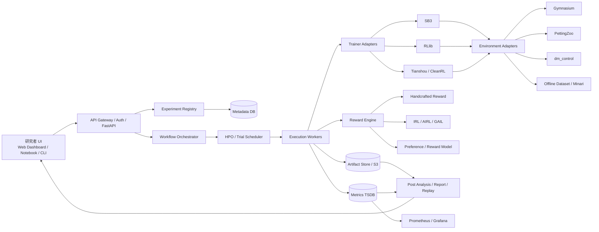
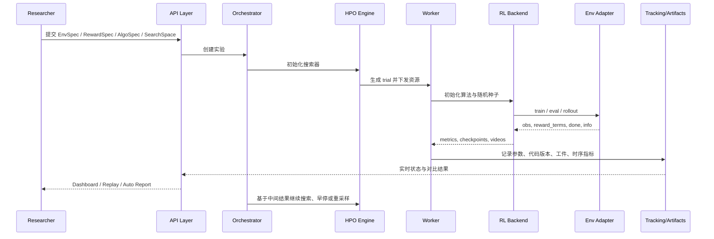

# 强化学习奖励函数设计与自动化调参可视化平台架构研究报告

## 执行摘要

从文献发展脉络看，强化学习中的奖励函数并不是“把目标写成一个分数”这么简单；它本质上是**目标规范（specification）**、**优化可学习性（learnability）**、**可验证性（verifiability）**三者之间的折中设计。经典结果表明，未经约束的启发式奖励塑形可能改变原问题的最优策略；只有满足潜在函数形式的塑形，才能在一般折扣 MDP 中保持策略不变。与此同时，逆强化学习、奖励建模、偏好学习与基于人类反馈的强化学习，把“奖励”从手工公式推进成了可学习对象，但也引入了可识别性不足、分布外泛化、奖励过优化与 reward hacking 等新风险。citeturn16search1turn0search1turn29search2turn0search2turn30search17turn18search0turn17search3turn17search0

如果任务是**长时程、稀疏成功信号、存在子阶段或明显安全约束**，当前更稳妥的路线通常不是依赖单一“万能加权和奖励”，而是采用分层设计：用清晰的终局任务奖励表达“真正成功”，用小权重的塑形或回报重分配改善信用分配，用显式约束或多目标方法表达安全/成本边界；在奖励依赖历史或任务具有顺序结构时，则应优先考虑层次化或结构化奖励，例如 options、MAXQ 或 reward machines。对于难以手工写清的目标，再引入 IRL、偏好建模或 RLHF。citeturn8search4turn1search6turn2search1turn32search1turn9view3turn3search1turn3search0turn4search2

如果要实现一个“强化学习调参的自动与可视化实现平台”，最重要的不是堆砌单个库，而是把系统拆成**控制平面、执行平面、数据平面、分析平面**四层，并通过**抽象接口、适配器模式、插件系统、标准化元数据与容器化**把 RL 后端、环境标准、奖励模块和可视化模块解耦。针对你未指定平台规模这一前提，比较稳妥的建议是：研究原型采用 Python 优先栈（FastAPI + Optuna/MLflow + SB3/Tianshou + Gymnasium）；可扩展系统采用工作流编排与分布式执行（FastAPI + Temporal 或 Celery + Ray Tune/RLlib + PostgreSQL/TimescaleDB + 对象存储 + Prometheus/Grafana + Docker/Kubernetes），并围绕 Gymnasium/PettingZoo/dm_control/Minari/Shimmy 构建统一环境 ABI。citeturn31search0turn6search0turn6search2turn5search1turn25search1turn7search0turn22search15turn31search2turn5search6turn5search2turn22search19turn23search2turn22search11turn23search1turn23search0turn7search2turn7search1turn25search14turn27search7

## 奖励函数设计

从方法论上，奖励函数可以分成四类：**手工工程型**、**基于演示/数据学习型**、**结构化/层次化型**、**多目标/约束型**。表中的归纳主要依据原始论文与高质量综述整理。citeturn16search1turn0search1turn0search2turn8search2turn1search0turn1search1turn4search2turn16search0

| 方法 | 核心原理 | 主要优点 | 常见陷阱 | 更适合的场景 |
|---|---|---|---|---|
| 稀疏奖励 | 只在成功/失败等关键事件给信号 | 语义清晰、先验偏置小、不易把“手段”误当“目标” | 探索难、样本效率低、延迟信用分配严重 | 目标清楚、可用 HER/演示/课程学习辅助探索 |
| 密集奖励 | 把“接近目标的进度”持续转成逐步奖励 | 学习快、早期稳定 | 最容易诱发代理目标偏差、局部循环刷分 | 进度度量天然可信的控制问题 |
| 启发式奖励塑形 | 额外添加子目标、距离、能耗等奖励项 | 工程上最直接、见效快 | 很可能改变最优策略；权重敏感 | 研究原型、先做可学习再逐步收敛到真实目标 |
| 潜在函数塑形 PBRS | 用 \(F(s,a,s')=\gamma \Phi(s')-\Phi(s)\) 形式加入塑形项 | 在标准条件下保持策略不变；理论最稳 | 需要构造好的 \(\Phi\)；状态别名会破坏效果 | 已知启发式价值函数或距离势能时 |
| 逆强化学习 IRL | 从专家行为反推潜在奖励 | 适合复杂目标、可减少手工奖励工程 | 奖励不唯一、对专家质量和环境模型依赖强 | 有高质量演示、关注“意图恢复”与迁移 |
| 奖励建模/偏好学习 | 从偏好比较或评分学习标量奖励模型 | 适合难以显式编程的目标 | 标注贵、模型可被过优化、OOD 泛化难 | 游戏行为、人类偏好、复杂语言/视觉目标 |
| 基于人类反馈 | 人类直接给 evaluative feedback 或偏好标注 | 可把隐性目标纳入训练 | 噪声、不一致、延迟反馈、交互成本 | 专家时间有限但可提供局部判断 |
| 对抗式奖励 | 用判别器区分专家与策略样本，隐式形成奖励/成本 | 高维模仿学习有效、可端到端 | 训练不稳定；未必恢复可迁移的“真奖励” | 模仿学习、无显式奖励但有专家轨迹 |
| 层次化/结构化奖励 | 用子任务、层次、有限状态机暴露任务结构 | 长时程任务更易学、可解释性更高 | 需要任务分解；坏层次会剪掉好策略 | 多阶段任务、顺序约束、非马尔可夫奖励 |
| 多目标/加权/约束奖励 | 奖励向量化，再做加权、Pareto 或约束优化 | 能显式表达收益/安全/成本权衡 | 加权和极度敏感；硬约束被“软化”后不可靠 | 安全控制、资源约束、性能-成本折中 |

### 稀疏奖励与密集奖励

稀疏奖励的最大优点不是“简单”，而是**更接近终局目标**。例如成功才给 1 分、其余为 0，这类定义常常比若干启发式距离项更不容易把优化导向错误方向；问题在于它把探索和信用分配的压力全部交给了算法。HER 的贡献就在于：把失败轨迹重新标注为“对于另一个目标其实是成功”的经验，从而显著改善目标条件任务中的样本效率。RUDDER 则直接针对延迟回报，把最终回报向关键前序事件重分配，降低 TD 学习的偏差与方差。citeturn8search0turn8search4turn1search2turn1search6

密集奖励本质上是在给算法加入“局部梯度信号”。它往往能让训练更快启动，但风险也最现实：如果“接近目标”的代理指标与“真正成功”之间存在缝隙，智能体就会去放大这个缝隙，形成 reward hacking。实践上更稳妥的方案通常不是纯密集奖励，而是“**稀疏主目标 + 小权重辅助项**”。辅助项的语义应该明确为“帮助探索”，而不是取代主目标。citeturn16search1turn17search3turn17search0

### 潜在函数与奖励塑形

Ng、Harada、Russell 的经典结论是：对折扣 MDP，除了正线性变换外，若额外奖励可以写成潜在函数差分，则最优策略保持不变；而任意一般性的塑形并无此保证。这个结果给了奖励工程一个非常重要的边界：**不是所有“看起来合理”的 shaping 都安全，只有满足 PBRS 条件的 shaping 才有普适策略不变性**。citeturn0search1turn29search4

Wiewiora 进一步说明，在相当广的策略类下，PBRS 与基于势函数的 Q 值初始化是等价的。工程含义很强：如果你只是想让学习一开始更“知道往哪走”，有时做初始化比往环境里硬塞塑形项更干净。常见陷阱包括：把潜在函数权重调得过大、在存在观测别名时用错误的 \(\Phi\)、或把依赖历史的任务强行写成状态势能。citeturn29search2turn29search14

### 逆强化学习、逆奖励设计与对抗式奖励

IRL 的出发点是：专家行为比手工奖励更容易获得，于是从行为反推奖励。Ng 与 Russell 给出经典形式化；Abbeel 与 Ng 的 apprenticeship learning 用特征期望匹配把 IRL 变成可操作的学习框架；Bayesian IRL 用先验表达对奖励的偏好；MaxEnt IRL 用最大熵原则处理“同一奖励下，专家仍可能非唯一行动”的不确定性。citeturn0search2turn8search3turn19search2turn8search2

但 IRL 的根本难点是**奖励歧义**：单一 MDP 中，一个最优策略通常对应一大簇兼容奖励。近年的理论工作把这个问题说得更清楚：即使可完美观察到最优行为，奖励也通常不可识别；在熵正则化、多个环境、多个折扣因子、或更多专家条件下，才有可能把奖励恢复到“相差一个常数”的程度。AIRL 的意义就在于，它把对抗式判别器拆成奖励近似器和塑形项，在其条件成立时能学习到对动力学变化更稳健、与 shaping 解耦的奖励。citeturn30search17turn30search10turn13view3turn13view4

如果你的核心痛点是“我写出来的奖励只是训练场景里的代理目标”，那么 Inverse Reward Design 的视角非常重要：**把设计出来的奖励看成设计者真实意图的一个有偏观测，而不是金科玉律**。在存在场景外分布偏移时，这个视角比继续微调某个加权和更可靠。citeturn19search0

### 奖励建模、偏好学习与人类反馈

偏好学习把“哪段行为更好”当作监督信号，而不是要求人类写出显式奖励。工程上最常见的是 Bradley–Terry / Boltzmann rational 模型：两段轨迹的偏好概率由它们预测回报差的指数形式确定。Christiano 等把这一思想用于深度 RL，证明了在 Atari 和机器人控制中，仅用少量人类比较反馈也能替代环境真奖励。之后，类似思想被用于摘要、指令跟随等 RLHF 管线。citeturn25search0turn0search3turn4search1turn4search0turn4search2

这类方法的优点是能表达难以程序化的目标，但它最大的工程风险恰恰来自“模型学到的是代理，不是人本身”。Gao、Schulman、Hilton 的研究系统展示了**奖励模型过优化**：随着策略越努力去最大化代理奖励，真实质量可能先升后降。这意味着平台层面不能只看 RM 分数上升，还必须保留独立 hold-out 评测、人工审查样本、KL 正则或行为支持约束，以及奖励模型版本化和回滚机制。citeturn18search0turn18search2turn28search3turn6search2

如果你希望更直接的人机交互，TAMER/Deep TAMER 这一路方法把人类反馈直接当作可学习的外部评价信号，而不是先学环境奖励。这类方法特别适合“人能看出好坏，但难写规则”的设置，只是交互成本高、反馈噪声大、扩展到大规模并行较困难。citeturn19search3turn19search14

### 层次化奖励、多目标奖励与结构化任务规范

长时程任务常常不是“奖励设计难”，而是“任务结构没有显式暴露给学习器”。options 框架、MAXQ 和 reward machines 都在解决这个问题。options 与 MAXQ 通过时间抽象分解策略；reward machines 则直接把奖励函数写成有限状态机，把“先做 A，再做 B，最后做 C”这样的任务语义显式暴露出来。Icarte 等给出的 QRM 在表格型场景下可收敛到最优策略，这一点比很多一般 HRL 方案更强。citeturn2search1turn32search1turn9view3

多目标 RL 进一步提醒我们：很多工程任务根本不是单一标量目标。性能、能耗、安全、平滑性、舒适度、延迟、成本常常互相冲突。简单加权和是最常见的工程做法，但文献已明确指出，是否应该线性标量化、是否需要 Pareto 前沿、是否应改写为约束优化，取决于决策语义本身。对于“绝不能违反”的条件，最好放进 cost/constraint 而不是仅仅加一个负奖励。CPO 之类方法的价值正在于此。citeturn3search1turn16search3turn3search0

## 理论与准则

### 设计原则

奖励设计最核心的原则，是**先定义目标，再定义代理，再定义优化压力**。换句话说，先明确“什么叫完成任务”“什么是不能做的”“什么只是训练辅助信号”，再决定是否把这些量压缩进一个标量回报。这个顺序如果倒过来，系统会自然滑向“为了训练方便而写奖励”，最后让策略去优化一个方便但错误的代理。Concrete Problems in AI Safety、Reward Tampering 和 IRD 都在不同角度说明：奖励失配不是边角问题，而是 RL 系统事故的主因之一。citeturn17search3turn17search0turn19search0

第二条原则是**尽量保持奖励的结构信息**。如果任务天然有阶段顺序，就用层次或 reward machine；如果目标天然是多维，就保留向量奖励；如果条件是硬边界，就建约束；如果奖励依赖历史，就扩展状态或显式地把历史状态机化。把这些语义统统压成一个单分数，虽可训练，却会显著加重调参负担，并削弱可解释性。citeturn9view3turn3search1turn3search0

第三条原则是**把奖励分量记录成一等公民**。平台应保存每个 reward term 的原始值、权重、裁剪规则、归一化规则以及最终标量合成方式。否则，一旦出现异常成功率、奇怪行为或 reward hacking，你甚至不知道是主任务项、探索项、正则项还是终止条件被“刷”了。对学习型奖励，还要把奖励模型版本、训练集、评估集和策略优化阶段的对应关系做成可追踪工件。citeturn6search2turn28search3

### 可证明性质速览

下表总结对奖励设计最有“工程含金量”的理论性质。其价值不在于背定理，而在于告诉你**哪些结构可以放心用，哪些问题本质上不可能靠继续调权重解决**。citeturn0search1turn29search2turn30search17turn13view3turn9view3turn32search1turn3search0

| 性质 | 关键结论 | 条件边界 | 工程含义 |
|---|---|---|---|
| 策略不变性 | PBRS 不改变最优策略 | 标准折扣 MDP；塑形需为潜在差分 | 想“加导航提示”时，先问自己是否能写成势函数 |
| 初始化等价性 | PBRS 与某类 Q 初始化等价 | 取决于策略类与实现细节 | 许多“塑形需求”可转为初始化/先验而非改环境 |
| IRL 非可识别性 | 单一最优行为通常不足以唯一确定奖励 | 经典 IRL 设置下普遍存在 | 不是调算法没调好，而是问题本身不充分 |
| 熵正则化可识别性改进 | 多环境/多折扣等可提高识别性，往往仅到常数项 | 需额外观测条件 | 若目标是“恢复真奖励”，数据收集方案必须升级 |
| AIRL 奖励解纠缠 | 在其条件下可把奖励与 shaping 分离 | 常见表述需状态型真奖励等条件 | 若关心迁移，不要只看模仿成功率，要看 reward transfer |
| QRM 收敛性 | QRM 在表格情形下收敛到最优策略 | 结构化 reward machine 设置 | 结构化奖励不是“花哨工程”，它有理论回报 |
| MAXQ 收敛性 | MAXQ-Q 收敛到递归最优策略 | 层次结构固定、满足条件 | 层次可提速，但层次本身会限定可到达最优性概念 |
| 约束满足性 | CPO 给出近约束满足与单调改进性质 | CMDP 设定 | 安全要求应优先建成 cost/constraint |

### 避免误导性奖励与 reward hacking

避免 reward hacking，最有效的方法通常不是再补一条负奖励，而是**重新划分责任边界**。对于硬安全边界，用约束；对于历史依赖的目标，用结构化状态；对于场景外风险，用 IRD/CIRL 式的不确定性建模；对于学习到的奖励，用独立 gold metric 和行为审计。把所有问题都压进一个加权和，往往只会让权重调参发散成“玄学”。citeturn19search0turn19search1turn3search0

对学习型奖励，必须做**代理—真实目标偏差监控**。最少应包含四类检查：其一，训练内 RM 分数与外部 gold 指标是否背离；其二，奖励模型在策略新分布上的不确定性是否升高；其三，策略是否学会操纵反馈通道本身；其四，换环境动力学、换初始状态、换对手后，奖励是否仍对应期望行为。AIRL、Reward Tampering、Corrupted Reward Channel 和 reward-model overoptimization 文献，事实上分别在处理这四类风险。citeturn13view4turn17search0turn2search3turn18search0

如果关注稳定性与样本效率，应优先使用“**结构化加速**”而非“盲目增大奖励幅度”。HER、RUDDER、演示初始化、层次任务分解、离线数据预热，通常比把塑形权重调大更稳，因为后者往往只是把优化压力更快地推到错误代理上。citeturn8search4turn1search6turn8search3turn9view3

## 文献综述

下面的文献表优先覆盖“原始论文 + 高质量综述”。挑选标准是：要么奠定了一个方法类别，要么给出了对工程特别重要的理论边界，要么直接影响如今的奖励建模与平台建设实践。citeturn16search6turn16search2turn16search0turn4search2

| 主题 | 关键文献与出处 | 为什么重要 |
|---|---|---|
| 奖励设计总论 | Eschmann, 2021, *Reward Function Design in Reinforcement Learning*, 书章，DOI: 10.1007/978-3-030-41188-6_3 | 对手工奖励、塑形、稀疏/密集、内在动机等做了紧凑总览，适合作为奖励工程入口 |
| 理论安全塑形 | Ng, Harada, Russell, 1999, ICML, ACM 记录常写作 10.5555/645528.657613 | 奠定了 PBRS 的策略不变性边界，是奖励塑形最重要的理论起点 |
| 塑形与初始化关系 | Wiewiora, 2003, JAIR, DOI: 10.1613/jair.1190 | 告诉工程师：很多“塑形需求”其实可以用初始化解决 |
| 经典 IRL | Ng & Russell, 2000, ICML | 把“从行为反推奖励”正式化，为后续 IRL 全线研究奠基 |
| Apprenticeship IRL | Abbeel & Ng, 2004, ICML, DOI: 10.1145/1015330.1015430 | 把 IRL 变成更实用的特征期望匹配框架 |
| Bayesian IRL | Ramachandran & Amir, 2007, IJCAI | 为奖励恢复引入先验与后验不确定性表述 |
| MaxEnt IRL | Ziebart et al., 2008, AAAI | 解决“专家行为不唯一”问题，是现代 IRL 基础组件之一 |
| 对抗式模仿学习 | Ho & Ermon, 2016, NeurIPS, ACM 记录常写作 10.5555/3157382.3157608 | GAIL 证明了判别器型奖励在高维模仿中的威力 |
| 可迁移奖励恢复 | Fu, Luo, Levine, 2018, ICLR, arXiv:1710.11248 | AIRL 把 reward learning 与 shaping disentanglement 结合，是“学奖励而非只学模仿”的关键一步 |
| 偏好学习奖励 | Christiano et al., 2017, NeurIPS, arXiv:1706.03741 | 说明少量人类比较即可训练复杂行为，开启了现代偏好奖励路线 |
| 直接人类评价 | Warnell et al., 2017, AAAI/ArXiv, arXiv:1709.10163 | Deep TAMER 展示了直接 evaluative feedback 的实用性 |
| 稀疏奖励改进 | Andrychowicz et al., 2017, NeurIPS, arXiv:1707.01495 | HER 成为目标条件稀疏奖励任务的标准基线 |
| 延迟奖励处理 | Arjona-Medina et al., 2019, NeurIPS, arXiv:1806.07857 | RUDDER 直接处理延迟回报与信用分配 |
| 层次化奖励结构 | Sutton, Precup, Singh, 1999, *Artificial Intelligence*, DOI: 10.1016/S0004-3702(99)00052-1；Dietterich, 2000, JAIR, DOI: 10.1613/jair.639 | options/MAXQ 奠定时间抽象与层次分解基础 |
| 奖励机器 | Toro Icarte et al., 2018, ICML/PMLR 80 | 让奖励函数本身显式暴露任务结构，并给出 QRM 收敛性 |
| 多目标 RL | Roijers et al., 2013, JAIR, DOI: 10.1613/jair.3987；Hayes et al., 2022, *Autonomous Agents and Multi-Agent Systems*, DOI: 10.1007/s10458-022-09552-y | 系统说明何时该用标量化、Pareto 前沿或别的解概念 |
| 约束优化 | Achiam et al., 2017, ICML/PMLR 70, arXiv:1705.10528 | 安全条件不应总被塞进 reward；CPO 是约束 RL 基线 |
| 价值对齐 | Hadfield-Menell et al., 2016, NeurIPS, arXiv:1606.03137 | CIRL 把“奖励未知但人知道”建模成合作博弈 |
| 奖励失配与抗 hacking | Hadfield-Menell et al., 2017, NeurIPS, arXiv:1711.02827；Everitt et al., 2021, *Synthese*, DOI: 10.1007/s11229-021-03141-4 | IRD 与 reward tampering 文献系统讨论奖励渠道与代理目标问题 |
| IRL 可识别性 | Cao, Cohen, Szpruch, 2021, NeurIPS | 明确指出经典 IRL 的非可识别性边界与改进条件 |
| RLHF 奖励模型风险 | Stiennon et al., 2020, NeurIPS, arXiv:2009.01325；Ouyang et al., 2022, NeurIPS, arXiv:2203.02155；Gao et al., 2023, ICML/PMLR 202, arXiv:2210.10760 | 构成现代 reward modeling / RLHF 的工程主线，也明确展示了过优化风险 |
| 高质量综述 | Arora & Doshi, 2021, *Artificial Intelligence*, DOI: 10.1016/j.artint.2021.103500；Adams et al., 2022, *Artificial Intelligence Review*, DOI: 10.1007/s10462-021-10108-x；Kaufmann et al., 2023, arXiv:2312.14925；Yu et al., 2025, IJCAI, DOI: 10.24963/ijcai.2025/1199 | 适合系统梳理 IRL、RLHF 与 reward model 研究脉络 |

## 实践与工具

历史基线方面，entity["organization","OpenAI","ai lab"] 的 Baselines 仍有“参考实现”的意义；现代 PyTorch 路线则以 Stable-Baselines3、RLlib、Tianshou、CleanRL 为主。研究型、可读性导向代码可参考 entity["organization","Google DeepMind","ai lab"] 的 Dopamine 与 Acme；奖励学习与偏好学习可直接用 `imitation` 和 entity["organization","Hugging Face","ai platform"] 的 TRL；环境标准建议围绕 entity["organization","Farama Foundation","open source org"] 维护的 Gymnasium、PettingZoo、Minari、Shimmy 构建统一入口。citeturn5search0turn5search1turn5search2turn25search1turn28search1turn5search3turn28search0turn26search1turn26search0turn7search0turn7search2turn25search14turn27search7

下表依据上述论文与官方文档，整理出各工具在“奖励设计与评估”中的实际分工。citeturn26search11turn26search16turn25search10turn25search21turn5search11turn25search15turn26search4turn28search10

| 工具/库 | 适合做什么 | 对奖励设计与评估的价值 | 更适合的规模 |
|---|---|---|---|
| Baselines | 历史复现实验、经典算法参考 | 适合核对“原始论文 vs 代码实现”差异 | 小型研究复现 |
| Stable-Baselines3 | 单机 RL、快速基线、定制环境训练 | 稳定、文档好，`check_env` 适合做环境与奖励接口校验 | 研究原型 |
| RLlib + Ray Tune | 分布式训练、多智能体、大规模 HPO | 对比实验、PBT/ASHA、分布式采样与容错较强 | 可扩展系统 |
| Tianshou | 研究友好的模块化 PyTorch RL | 统一接口、在线/离线兼顾，适合快速试验奖励消融 | 研究原型到中型平台 |
| CleanRL | 单文件实现、可审计训练逻辑 | 非常适合验证“奖励改动到底影响了哪里” | 研究原型 |
| Dopamine / Acme | 可读性强的研究框架 | 适合做算法级与组件级消融，而不是重工程封装 | 研究型代码库 |
| imitation | AIRL/GAIL/偏好比较/DRLHP | 是做 reward learning、IRL、偏好学习的首选现成工具之一 | 研究原型 |
| TRL | RewardTrainer、PPO/GRPO/DPO 等 | 适合 LLM 奖励建模与 post-training 管线接入 | 语言模型场景 |
| Gymnasium / PettingZoo / dm_control / Minari / Shimmy | 单智能体、多智能体、连续控制、离线数据与兼容层 | 统一环境 ABI、离线数据标准和旧环境迁移能力 | 所有规模 |
| MLflow / W&B / Open RL Benchmark | 实验追踪、工件版本、可比性输出 | 是奖励敏感性分析、对比实验和可复现性的基础设施 | 所有规模 |

一个很实用的组合是：**研究原型**用 `SB3 + imitation + Gymnasium + Optuna + MLflow`；**大规模系统**用 `RLlib + Ray Tune + PettingZoo/Gymnasium + MinIO/S3 + Prometheus/Grafana + W&B 或 MLflow`。前者强调快实现、快迭代；后者强调调度、追踪与横向扩展。citeturn27search1turn27search12turn26search1turn6search0turn6search2turn26search16turn5search6turn7search2turn7search0turn33search14turn23search2turn22search11turn6search3turn28search3

## 平台设计

### 总体架构

针对“自动化调参 + 奖励工程 + 可视化 + 兼容多 RL 库/环境”的目标，一个高内聚、低耦合的分层架构比选某个单点框架更重要。下面这个架构把系统分成：用户与 API 层、实验控制层、训练执行层、数据与分析层。其实现能力主要由 FastAPI/Uvicorn/ASGI、Temporal 或 Celery、Ray Tune/RLlib、MLflow、Prometheus、Grafana、Docker 与 Kubernetes 这些成熟组件支撑。citeturn31search0turn31search1turn31search4turn22search15turn31search2turn5search6turn5search2turn6search2turn23search2turn22search11turn23search1turn23search0

这个架构的关键不是“多”，而是**边界清晰**。控制平面只负责定义实验、调度试验和管理状态；执行平面只负责训练与评估；奖励模块不直接绑死某一个 RL 框架；环境模块也不向训练器暴露具体库的私有 API，而只暴露统一的 `EnvSpec` 与 `step/reset/seed/render` 抽象。这样做后，你才能同时兼容 Gymnasium、PettingZoo、dm_control 和旧 Gym 环境，也才能在 SB3、RLlib、Tianshou、CleanRL 之间切换。citeturn27search0turn27search2turn27search3turn27search7turn5search17turn26search16turn25search13turn28search1

### 模块划分与接口规范

建议平台内部统一四个元对象：

| 对象 | 建议字段 | 作用 |
|---|---|---|
| `EnvSpec` | `env_id`, `api_standard`, `single_or_multi_agent`, `obs_space`, `action_space`, `seedable`, `vectorizable`, `supports_render` | 抽象环境能力，解除训练器对具体环境库的依赖 |
| `RewardSpec` | `source_type`, `terms`, `weights`, `aggregation`, `clip`, `normalize`, `requires_history`, `model_artifact` | 把奖励从“埋在环境里的硬编码”提升为独立配置对象 |
| `AlgoSpec` | `backend`, `algorithm`, `policy_type`, `supports_offpolicy`, `search_space`, `resource_profile`, `checkpoint_format` | 抽象训练器差异 |
| `RunSpec` | `git_commit`, `image_digest`, `seed_root`, `dataset_refs`, `env_spec_ref`, `reward_spec_ref`, `algo_spec_ref`, `stopping_rule` | 保证可复现与版本追踪 |

这四个对象的价值在于：你可以把“奖励函数改变了什么”“算法超参改变了什么”“环境版本改变了什么”分别建模，而不是让它们混在同一段 Python 脚本里。对于研究平台，这样做能大幅降低调参与 ablation 的认知成本；对于生产系统，这样做则是在为审计、复盘和回滚做准备。citeturn6search2turn28search3turn23search1

### 自动化功能设计

平台的自动化能力应围绕三条主线展开：**自动超参搜索、自动奖励敏感性分析、自动对比与回放**。

第一条主线是自动 HPO。下表依据 Hyperband、ASHA、PBT、BOHB 等原始论文与 Ax/Optuna/Ray Tune 文档整理。citeturn20search1turn21search1turn20search3turn20search4turn6search0turn6search1turn5search6

| 搜索算法 | 优势 | 弱点 | 更适合的 RL 场景 | 平台建议 |
|---|---|---|---|---|
| Random / Grid | 基线清楚、实现简单 | 样本利用率低 | 低维搜索空间、做 sanity check | 任何平台都保留 |
| Bayesian Optimization | 对“昂贵试验”样本效率高 | 高维、强离散空间下效果不稳定 | 试验成本高、参数不多 | 用 Ax 或 Optuna Sampler |
| Hyperband / ASHA | 能早停差试验、吞吐高 | 对噪声和预算设置敏感 | RL 这类高成本试验的默认首选 | 原型和生产都推荐 |
| BOHB | 结合 BO 与多保真早停 | 系统复杂度高于 ASHA | 中高维且预算紧张 | 用于中大型平台 |
| PBT | 能学到“超参随训练阶段变化的 schedule” | 复现实验比静态超参更难 | PPO、IMPALA、长训练流程 | 分布式系统重点支持 |

第二条主线是自动奖励敏感性分析。实践上，平台不应只记录总回报，而应对每个 reward term 自动做：系数微扰、局部弹性估计、截断/归一化前后对比、term-level Pareto 图、轨迹回放叠加 reward heatmap。对于学习型奖励，再加上 RM 版本对比、校准曲线、hold-out preference accuracy 与 proxy-vs-gold divergence 曲线。这样你才能区分“算法没调好”和“奖励本身不可优化”。这一点对于避免 reward model overoptimization 和 reward hacking 尤为重要。citeturn18search0turn17search0turn6search2turn28search3

第三条主线是自动对比与回放。平台应原生支持：同环境多奖励函数对比、同奖励函数多算法对比、同算法多超参对比、策略视频回放、回报分量逐帧叠加，以及自动生成实验报告。Open RL Benchmark 的思路很值得借鉴：把“实验比较图表”从研究者的临时脚本提升为平台内建能力。citeturn28search2turn28search10

### 技术选型建议

在默认 Python 优先的前提下，可把选型分为**研究原型**与**可扩展系统**两档。下面的建议主要依据官方文档能力边界以及 RL 社区已有使用习惯。citeturn31search0turn22search15turn31search2turn22search19turn23search2turn22search11turn23search1turn23search0

| 模块 | 研究原型建议 | 可扩展系统建议 | 说明 |
|---|---|---|---|
| API 后端 | FastAPI + Uvicorn | FastAPI + Uvicorn + API Gateway | 类型标注、OpenAPI、异步友好，适合 Python-first |
| 工作流/任务编排 | Celery + Redis | Temporal 或 Celery + broker + retry policy | 单机/中小规模用 Celery；强可靠长流程更适合 Temporal |
| 实验与元数据 | PostgreSQL | PostgreSQL + JSONB + 权限/审计 | 结构化查询与灵活元数据并存 |
| 指标时序库 | PostgreSQL 或 MLflow 内置 | TimescaleDB 或 ClickHouse | 大量 step-level 指标更适合专门时序/分析存储 |
| 工件存储 | 本地文件系统/MinIO | S3/MinIO + Parquet/对象版本化 | 训练日志、视频、checkpoint 统一走对象存储 |
| 训练后端 | SB3 / Tianshou / CleanRL | RLlib + SB3/Tianshou 适配层 | 小规模研究先快，规模化再引入 RLlib |
| HPO | Optuna | Ray Tune + Optuna/Ax/BOHB/PBT | 单机与分布式统一抽象 |
| 监控 | MLflow UI | Prometheus + Grafana + MLflow/W&B | 运维监控与实验追踪分层 |
| 前端 | Dash | React + ECharts/Vega-Lite + React Flow | 原型重开发效率，生产重可组合性 |
| 部署 | Docker Compose | Docker + Kubernetes | K8s 负责资源隔离、横向扩容与调度 |

## 兼容性与可扩展性策略

### 兼容性总思路

兼容性不是“支持尽可能多的库”，而是**把变化隔离在适配器边界**。单智能体环境以 Gymnasium ABI 作为规范中心，多智能体以 PettingZoo 为规范中心，legacy Gym 通过 Shimmy 兼容，dm_control 通过专门 adapter 暴露为统一 `EnvSpec`。这样做的结果是：上层 HPO、可视化、实验追踪和奖励分析根本不需要知道底层到底是哪个环境库。citeturn7search16turn27search2turn27search7turn7search1

训练后端也应采用同样策略。所有后端统一实现 `fit() / evaluate() / save() / load() / export()` 五个能力接口；内部 checkpoint 保持 native 格式，跨系统部署时再导出 ONNX 或其他推理格式。这样既不强迫你用一个对训练不友好的公共格式，又保留了后续部署与跨语言调用的互操作路径。ONNX/ONNX Runtime 的价值，正是在这里：它们把“推理部署兼容性”和“训练框架兼容性”分开处理。citeturn7search19turn7search3turn7search7turn7search11

### 可插拔策略

建议同时支持两种插件形态：**进程内插件**与**进程外插件**。前者适合 Python 生态中的奖励函数、环境包装器、评价器与可视化组件；后者适合 C++/Rust/Go 编写的高性能环境、仿真器或评估器。控制消息走 JSON/REST 或 gRPC 风格接口，批量轨迹、指标表格与离线样本尽量走 Parquet/Arrow 这类列式或零拷贝友好格式。Arrow/Flight 的选择尤其适合跨语言高吞吐数据服务，但要注意 Flight 官方文档明确提示其 API 仍可能演进。citeturn23search7turn23search3turn23search11turn33search7turn33search9

### 流程图

下面这个流程图体现了“实验提交—自动搜索—训练执行—多维分析—前端反馈”的闭环。它是平台最关键的工作流抽象。citeturn5search6turn6search2turn28search3turn22search15

### 设计选项比较

下表分别比较数据库、可视化库与 RL 框架的选项，便于你做“原型优先”还是“系统优先”的取舍。其整理依据主要来自 PostgreSQL/TimescaleDB/ClickHouse/DuckDB/Parquet/MinIO，以及 Dash/ECharts/Vega-Lite/React Flow/Grafana，和 SB3/RLlib/Tianshou/CleanRL/Dopamine/Acme 等官方文档。citeturn22search4turn22search19turn33search0turn33search9turn33search14turn24search1turn24search0turn24search7turn24search2turn22search11turn26search11turn26search16turn25search10turn28search1turn5search11turn28search0

#### 数据库与存储

| 方案 | 优势 | 局限 | 推荐位置 |
|---|---|---|---|
| PostgreSQL + JSONB | 事务、关系查询、灵活元数据都强 | 海量 step-level 时序写入会变重 | 元数据主库 |
| PostgreSQL + TimescaleDB | 兼顾 PostgreSQL 生态与时序扩展 | 运维复杂度高于纯 PG | 中大型平台指标库 |
| ClickHouse | 大规模分析查询强、时序/日志友好 | 事务语义不如 PG | 超大规模分析层 |
| DuckDB + Parquet | 本地分析与离线报告非常高效 | 不适合作在线主库 | 训练后离线分析 |
| MinIO / S3 | 工件、视频、checkpoint、数据集版本化方便 | 需要配套元数据索引 | 对象存储层 |

#### 可视化库

| 方案 | 优势 | 局限 | 推荐位置 |
|---|---|---|---|
| Dash | Python 原生、快速出原型 | 前后端深度定制不如 React | 原型仪表盘 |
| Apache ECharts | 图表类型丰富、性能高 | 需要前端工程化 | 生产级交互图表 |
| Vega-Lite | 声明式 JSON，适合标准化图表生成 | 自由布局能力有限 | 自动报告与配置驱动图表 |
| React Flow | 节点式 UI 强 | 不是传统 chart 库 | 奖励流程图、任务图、搜索图 |
| Grafana | 时序监控成熟 | 偏运维监控，不是研究交互 IDE | 线上监控与告警 |

#### RL 框架

| 框架 | 长处 | 短处 | 最合适的角色 |
|---|---|---|---|
| Stable-Baselines3 | 稳定、文档好、基线强 | 大规模分布式一般 | 单机基线与原型 |
| RLlib | 分布式、单/多智能体、Tune 集成强 | 抽象层更厚 | 中大型平台核心后端 |
| Tianshou | 模块化、研究友好、在线/离线兼容 | 社区生态不如 SB3/RLlib 广 | 研究平台候选 |
| CleanRL | 代码短、易审计 | 工程功能少 | 奖励消融与教学型后端 |
| Dopamine / Acme | 研究可读性高、适合做基础组件 | 不以通用平台封装见长 | 研究基线与可读实现 |

### 安全与可复现性措施

可复现性方面，至少要固化六类信息：代码版本、镜像摘要、数据集工件版本、环境版本、随机种子根、奖励配置哈希。MLflow 可记录参数、代码版本、指标和输出文件；W&B Artifacts 可记录数据与模型工件版本；Docker 镜像可冻结运行时依赖；Kubernetes 则可把资源请求、GPU 类型和调度策略写成声明式配置。只记录“最终最佳超参”远远不够，必须能完整回答“这个结果到底是在哪个奖励、哪个环境、哪个 commit、哪个依赖栈下跑出来的”。citeturn6search2turn28search3turn23search1turn23search0

安全方面，重点不是传统网络安全，而是**奖励与实验链路安全**。建议采用：奖励函数单元测试、禁用线上直接改 reward 权重、append-only 结果日志、训练前后 reward decomposition 校验、对学习型奖励做 OOD 检测与人工抽检、对关键任务使用 constraint/cost 双通道验证，以及对回放视频做可追溯水印。对潜在 reward tampering 风险高的任务，还应把反馈通道与环境通道分离，避免策略轻易操纵“得分器”本身。citeturn17search0turn2search3turn17search3

## 参考文献

以下按正文首次出现顺序列出，优先给出 DOI 或 arXiv 标识；官方文档类资料在无 DOI/arXiv 时标注为“官方文档”。

1. Jonas Eschmann. 2021. *Reward Function Design in Reinforcement Learning*. 载于 *Reinforcement Learning Algorithms: Analysis and Applications*. DOI: 10.1007/978-3-030-41188-6_3。citeturn16search1  
2. Andrew Y. Ng, Daishi Harada, Stuart Russell. 1999. *Policy Invariance under Reward Transformations: Theory and Application to Reward Shaping*. ICML. ACM 记录常见标识：10.5555/645528.657613。citeturn29search1turn0search1  
3. Eric Wiewiora. 2003. *Potential-Based Shaping and Q-Value Initialization are Equivalent*. *Journal of Artificial Intelligence Research*, 19:205–208. DOI: 10.1613/jair.1190。citeturn29search14turn29search2  
4. Andrew Y. Ng, Stuart Russell. 2000. *Algorithms for Inverse Reinforcement Learning*. ICML。citeturn0search2  
5. Pieter Abbeel, Andrew Y. Ng. 2004. *Apprenticeship Learning via Inverse Reinforcement Learning*. ICML. DOI: 10.1145/1015330.1015430。citeturn8search15turn8search3  
6. Deepak Ramachandran, Eyal Amir. 2007. *Bayesian Inverse Reinforcement Learning*. IJCAI。citeturn19search2  
7. Brian D. Ziebart, Andrew Maas, J. Andrew Bagnell, Anind K. Dey. 2008. *Maximum Entropy Inverse Reinforcement Learning*. AAAI。citeturn8search2turn8search6  
8. Jonathan Ho, Stefano Ermon. 2016. *Generative Adversarial Imitation Learning*. NeurIPS. ACM 记录常见标识：10.5555/3157382.3157608。citeturn1search0turn1search8  
9. Justin Fu, Katie Luo, Sergey Levine. 2018. *Learning Robust Rewards with Adversarial Inverse Reinforcement Learning*. ICLR. arXiv:1710.11248。citeturn1search1turn13view3  
10. Paul Christiano, Jan Leike, Tom B. Brown, Miljan Martic, Shane Legg, Dario Amodei. 2017. *Deep Reinforcement Learning from Human Preferences*. NeurIPS. arXiv:1706.03741。citeturn0search3turn0search7  
11. Garrett Warnell, Nicholas Waytowich, Vernon Lawhern, Peter Stone. 2017. *Deep TAMER: Interactive Agent Shaping in High-Dimensional State Spaces*. arXiv:1709.10163。citeturn19search3  
12. Nisan Stiennon, Long Ouyang, Jeff Wu, Daniel Ziegler, Ryan Lowe, Chelsea Voss, Alec Radford, Dario Amodei, Paul Christiano. 2020. *Learning to Summarize from Human Feedback*. NeurIPS. arXiv:2009.01325。citeturn4search1turn4search9  
13. Long Ouyang et al. 2022. *Training Language Models to Follow Instructions with Human Feedback*. NeurIPS. arXiv:2203.02155。citeturn4search0turn4search8  
14. Timo Kaufmann, Paul Weng, Viktor Bengs, Eyke Hüllermeier. 2023. *A Survey of Reinforcement Learning from Human Feedback*. arXiv:2312.14925。citeturn4search2  
15. Richard S. Sutton, Doina Precup, Satinder Singh. 1999. *Between MDPs and Semi-MDPs: A Framework for Temporal Abstraction in Reinforcement Learning*. *Artificial Intelligence*, 112(1–2):181–211. DOI: 10.1016/S0004-3702(99)00052-1。citeturn29search9turn2search1  
16. Thomas G. Dietterich. 2000. *Hierarchical Reinforcement Learning with the MAXQ Value Function Decomposition*. *Journal of Artificial Intelligence Research*, 13:227–303. DOI: 10.1613/jair.639。citeturn32search17turn32search1  
17. Rodrigo Toro Icarte, Toryn Q. Klassen, Richard Valenzano, Sheila A. McIlraith. 2018. *Using Reward Machines for High-Level Task Specification and Decomposition in Reinforcement Learning*. ICML/PMLR 80。citeturn9view3turn1search7  
18. Diederik M. Roijers, Peter Vamplew, Shimon Whiteson, Richard Dazeley. 2013. *A Survey of Multi-Objective Sequential Decision-Making*. *Journal of Artificial Intelligence Research*, 48:67–113. DOI: 10.1613/jair.3987。citeturn3search1turn3search13  
19. Conor F. Hayes et al. 2022. *A Practical Guide to Multi-Objective Reinforcement Learning and Planning*. *Autonomous Agents and Multi-Agent Systems*, 36(1):26. DOI: 10.1007/s10458-022-09552-y。citeturn16search3turn16search15  
20. Joshua Achiam, David Held, Aviv Tamar, Pieter Abbeel. 2017. *Constrained Policy Optimization*. ICML/PMLR 70. arXiv:1705.10528。citeturn3search0turn3search8  
21. Marcin Andrychowicz et al. 2017. *Hindsight Experience Replay*. NeurIPS. arXiv:1707.01495。citeturn8search0turn8search4  
22. Jose A. Arjona-Medina et al. 2019. *RUDDER: Return Decomposition for Delayed Rewards*. NeurIPS. arXiv:1806.07857。citeturn1search2turn1search6  
23. Dario Amodei, Chris Olah, Jacob Steinhardt, Paul Christiano, John Schulman, Dan Mané. 2016. *Concrete Problems in AI Safety*. arXiv:1606.06565。citeturn17search3  
24. Tom Everitt, Marcus Hutter, Ramana Kumar, Victoria Krakovna. 2021. *Reward Tampering Problems and Solutions in Reinforcement Learning: A Causal Influence Diagram Perspective*. *Synthese*, 198(Suppl 27):6435–6467. DOI: 10.1007/s11229-021-03141-4。citeturn17search12turn17search0  
25. Dylan Hadfield-Menell, Smitha Milli, Pieter Abbeel, Stuart Russell, Anca Dragan. 2017. *Inverse Reward Design*. NeurIPS. arXiv:1711.02827。citeturn19search0  
26. Dylan Hadfield-Menell, Anca Dragan, Pieter Abbeel, Stuart Russell. 2016. *Cooperative Inverse Reinforcement Learning*. NeurIPS. arXiv:1606.03137。citeturn4search3turn19search1  
27. Haoyang Cao, Samuel N. Cohen, Lukasz Szpruch. 2021. *Identifiability in Inverse Reinforcement Learning*. NeurIPS。citeturn30search17turn30search10  
28. Leo Gao, John Schulman, Jacob Hilton. 2023. *Scaling Laws for Reward Model Overoptimization*. ICML/PMLR 202. arXiv:2210.10760。citeturn18search0turn18search2  
29. Saurabh Arora, Prashant Doshi. 2021. *A Survey of Inverse Reinforcement Learning: Challenges, Methods and Progress*. *Artificial Intelligence*, 297:103500. DOI: 10.1016/j.artint.2021.103500。citeturn16search6  
30. Stephen Adams, Tyler Cody, Peter Adam Beling. 2022. *A Survey of Inverse Reinforcement Learning*. *Artificial Intelligence Review*, 55:4307–4346. DOI: 10.1007/s10462-021-10108-x。citeturn16search2  
31. Rui Yu et al. 2025. *Reward Models in Deep Reinforcement Learning: A Survey*. IJCAI 2025. DOI: 10.24963/ijcai.2025/1199。citeturn16search4turn16search8  
32. 工程资料：Baselines 仓库；Stable-Baselines3 文档与 JMLR 论文；RLlib/Ray Tune 文档。主要用于训练后端与 HPO 选型比较。citeturn5search0turn5search1turn26search11turn5search2turn5search6  
33. 工程资料：Dopamine 论文与文档；Acme 仓库；Tianshou 文档与 JMLR 论文；CleanRL 文档；Open RL Benchmark 资料。主要用于研究型可读实现和结果比较。citeturn5search11turn5search3turn28search0turn25search10turn25search1turn28search1turn28search2turn28search10  
34. 工程资料：`imitation` 文档/论文；TRL RewardTrainer 文档。主要用于 AIRL/GAIL/偏好比较与 LLM 奖励建模。citeturn26search1turn25search0turn25search21turn26search0turn26search4  
35. 工程资料：Gymnasium、PettingZoo、dm_control、Minari、Shimmy 与 `check_env`/环境测试文档。主要用于统一环境 ABI 与兼容层设计。citeturn7search0turn7search2turn7search1turn25search14turn27search7turn27search1turn27search6  
36. 工程资料：Optuna、Ax、MLflow、W&B Sweeps/Artifacts 官方文档。主要用于 HPO、实验追踪与工件版本化。citeturn6search0turn6search1turn6search2turn6search3turn28search3  
37. 工程资料：FastAPI、Uvicorn、ASGI、Temporal、Celery 官方文档。主要用于 API 层、异步服务与工作流/任务编排。citeturn31search0turn31search1turn31search4turn22search15turn31search2  
38. 工程资料：PostgreSQL JSONB、TimescaleDB、ClickHouse、DuckDB、Parquet、MinIO 官方文档。主要用于元数据、时序指标、离线分析与对象存储选型。citeturn22search4turn22search19turn33search0turn33search9turn33search7turn33search14  
39. 工程资料：Prometheus、Grafana、Docker、Kubernetes HPA 官方文档。主要用于监控、仪表盘、容器化与资源调度。citeturn23search2turn22search11turn23search1turn23search0  
40. 工程资料：Apache ECharts、Dash、Vega-Lite、React Flow 官方文档。主要用于仪表盘、节点式工作流编辑与自动图表生成。citeturn24search0turn24search1turn24search7turn24search2  
41. 工程资料：ONNX、ONNX Runtime、Apache Arrow/Arrow Flight 官方文档。主要用于模型互操作与跨语言高吞吐数据交换。citeturn7search19turn7search3turn23search7turn23search3turn23search11